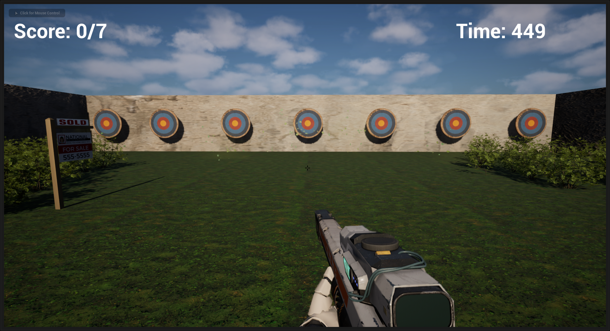
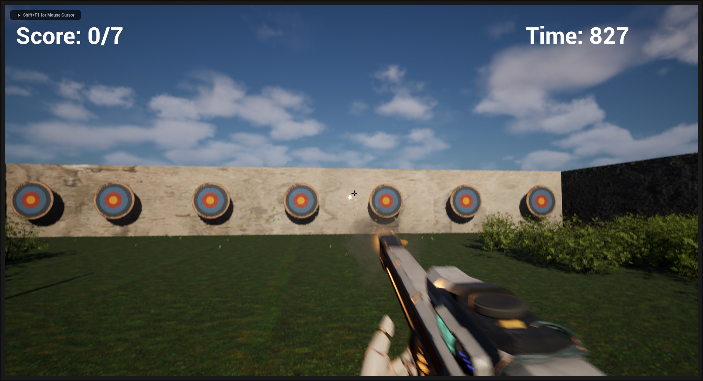
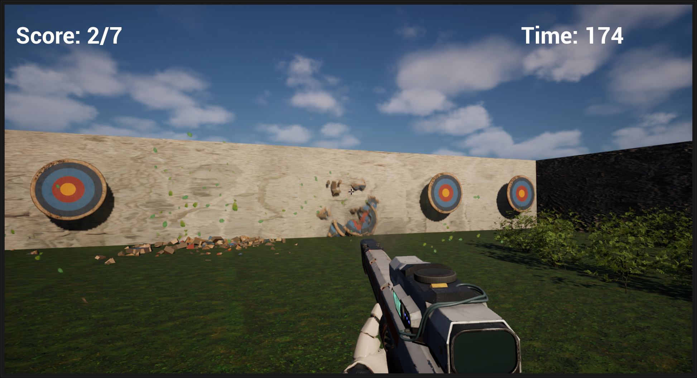

# First Person Target Practice 🎯

This is my first larger Unreal Engine 5.5 project. A timed first-person shooting challenge where the goal is to destroy seven destructible targets before the clock hits zero. The rifle includes muzzle flash particle effects when firing, and each target crumbles apart using destructible geometry for visual feedback.

I followed along with the excellent Unreal Sensei YouTube tutorial to learn the core setup and Blueprint logic, then added my own touches to finish the project. Excited to keep improving my Unreal skills and build more polished projects in the future.

---

## 📸 Screenshots

_Starting position with all targets visible_

_Shooting at targets mid-game_

_Targets breaking apart after being hit_
